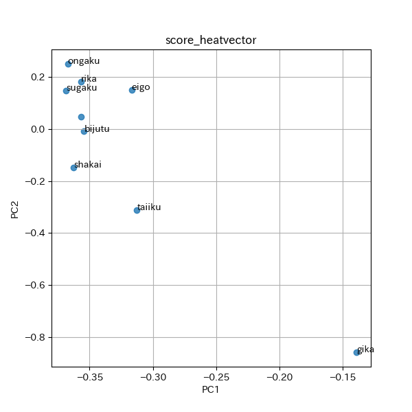

# 統計分析法　第一回レポート

## 実行環境

python3.9

- pipenv

(これ以降のモジュールは`pipenv update`でダウンロードできます)

- pandas
- matplotlib
- cogapp
- scipy
- scikit-learn

## ファイルのエンコーディングについて

`output/pokemon.txt`,`output/seiseki.txt`については、shift-jisで読み込むことができたが、`output/baseball.txt`については、shift-jisでエンコーディングしても、エラーが出たため、UTF-8でエンコーディングしている。

## 主成分分析の流れについて

主成分分析は`sklearn.decomposition.PCA`を用いて行った。

データについては、比例尺度を取り出した後、標準化して渡している。

また、固有値、寄与率はぞれぞれ、`sklearn.decomposition.PCA.explained_variance`,`sklearn.decomposition.PCA.explained_variance_ratio`を用いて取得し、累積寄与率は、`numpy.cumsum()`を使って、計算した。

## 中学生の成績データの分析

成績のデータは、すべて比例尺度であるため、すべてのデータを主成分分析に用いた。

#### 実行結果

今回、入力に使ったデータ、主成分得点、固有値・寄与率・累積寄与率、固有ベクトルを順に示す。

[source code](seiseki-analize.py)

<!-- [[[cog
import cog
file="output/seiseki-analize.txt"
cog.outl("\n```bash")
with open(file,"r") as f:
    cog.outl(f.read())
cog.outl("```")
    ]]] -->

```bash
$ pipenv run python3 seiseki-analize.py
data:
   kokugo  shakai  sugaku   rika  ongaku  bijutu  taiiku  gika  eigo
0    30.0    43.0    51.0   63.0    60.0    66.0    37.0  44.0  20.0
1    39.0    21.0    49.0   56.0    70.0    72.0    56.0  63.0  16.0
2    29.0    30.0    23.0   57.0    69.0    76.0    33.0  54.0   6.0
3    95.0    87.0    77.0  100.0    77.0    82.0    78.0  96.0  87.0
4    70.0    71.0    78.0   67.0    72.0    82.0    46.0  63.0  44.0
score:
        PC1       PC2       PC3  ...       PC7       PC8       PC9
0  0.056415  0.916870 -0.115763  ... -0.366566  0.271820 -0.091322
1 -0.147906 -0.000470  0.659867  ...  0.438794 -0.209384 -0.060319
2  0.540050  0.542761  0.963296  ... -0.341034 -0.500300  0.156104
3 -5.107249  0.228059  0.625819  ... -0.301719  0.242537  0.313485
4 -2.636544  0.661026  0.012114  ...  0.195361  0.287273 -0.632364

[5 rows x 9 columns]
states:
     eigenvalue  contribution  contributioin_sum
PC1    6.006431      0.667381           0.667381
PC2    1.098185      0.122021           0.789402
PC3    0.490842      0.054538           0.843940
PC4    0.406976      0.045220           0.889159
PC5    0.300260      0.033362           0.922522
PC6    0.221459      0.024607           0.947128
PC7    0.182787      0.020310           0.967438
PC8    0.171195      0.019022           0.986460
PC9    0.121864      0.013540           1.000000
component:
       kokugo    shakai    sugaku  ...    taiiku      gika      eigo
PC1 -0.362639 -0.368570 -0.356895  ... -0.139248 -0.316726 -0.356949
PC2 -0.149422  0.147029  0.181437  ... -0.859298  0.148958  0.046610
PC3  0.073623 -0.061551 -0.399680  ... -0.080264  0.783869 -0.317273
PC4 -0.236443 -0.106524  0.029476  ... -0.284248 -0.293357 -0.354812
PC5 -0.301468 -0.086651 -0.061124  ...  0.268566  0.189814 -0.338372

[5 rows x 9 columns]

```
<!-- [[[end]]] -->

[主成分得点のすべてのデータ](output/score_score.csv)

[固有ベクトルのすべてのデータ](output/score_component.csv)

また、各生徒と各科目を第一・第二主成分でプロットしたものを順に示す。




科目と主成分との関係を見ると、`音楽`、`数学`、`社会`など、日頃の予習・復習が必要な科目が第一主成分の係数が大きく、`技術・家庭`、`音楽`など、単語の暗記が多く必要な科目が第二主成分と係数が大きくなっている。

そのことから、中学生のテストの成績の第一主成分は日頃の演習、第二主成分は物覚えのよさだと考える。

## プロ野球の個人成績の分析

打撃成績のデータには、まず、名義尺度として、`選手`、`チーム`が、他の比例尺度に大きく関係する変数として`打席`、`試合`、`打数`、`塁打`が含まれるため、それらのデータを除外して主成分分析を行った。

#### 実行結果

今回、入力に使ったデータ、主成分得点、固有値・寄与率・累積寄与率、固有ベクトルを順に示す。

[source code](baseball-analize.py)

<!-- [[[cog
import cog
file="output/baseball-analize.txt"
cog.outl("\n```bash")
with open(file,"r") as f:
    cog.outl(f.read())
cog.outl("```")
    ]]] -->

```bash
$ pipenv run python3 baseball-analize.py
data:
      打率    得点     安打   二塁打  三塁打   本塁打  ...  故意四   死球     三振   併殺打    長打率    出塁率
0  0.258  42.0  121.0  24.0  2.0  13.0  ...  2.0  2.0   80.0  18.0  0.401  0.293
1  0.248  47.0  101.0  21.0  1.0  20.0  ...  5.0  1.0   89.0  11.0  0.451  0.328
2  0.234  42.0   96.0  18.0  1.0  21.0  ...  4.0  5.0  116.0  12.0  0.437  0.302
3  0.275  44.0  132.0  23.0  1.0  17.0  ...  9.0  8.0   56.0  15.0  0.433  0.333
4  0.258  55.0  115.0  18.0  1.0  22.0  ...  3.0  4.0   72.0  16.0  0.451  0.367

[5 rows x 18 columns]
score:
        PC1       PC2       PC3  ...      PC16      PC17      PC18
0 -0.875971 -2.101361 -1.145719  ... -0.091380  0.044781  0.052915
1  0.162222 -2.475730  0.456200  ... -0.087854 -0.061537 -0.004547
2 -0.720330 -2.809543  1.381736  ...  0.049439 -0.045725  0.045695
3  1.124713 -1.363621 -1.099740  ... -0.171127 -0.002819 -0.047061
4  1.255582 -1.873577 -0.189427  ...  0.132731 -0.009550  0.010578

[5 rows x 18 columns]
states:
      eigenvalue  contribution  contributioin_sum
PC1     5.843945      0.324664           0.324664
PC2     3.529267      0.196070           0.520734
PC3     1.916198      0.106455           0.627189
PC4     1.207885      0.067105           0.694294
PC5     1.080686      0.060038           0.754332
PC6     0.901651      0.050092           0.804424
PC7     0.742830      0.041268           0.845692
PC8     0.598382      0.033243           0.878936
PC9     0.546412      0.030356           0.909292
PC10    0.460169      0.025565           0.934857
PC11    0.357147      0.019842           0.954698
PC12    0.267030      0.014835           0.969533
PC13    0.237133      0.013174           0.982708
PC14    0.161819      0.008990           0.991698
PC15    0.110896      0.006161           0.997858
PC16    0.033279      0.001849           0.999707
PC17    0.002890      0.000161           0.999868
PC18    0.002379      0.000132           1.000000
component:
           打率        得点        安打  ...       併殺打       長打率       出塁率
PC1  0.229009  0.264519  0.230506  ...  0.163286  0.378652  0.300549
PC2  0.283651  0.323710  0.316264  ... -0.237544  0.015644  0.198137
PC3 -0.330983  0.122401 -0.275300  ... -0.307686  0.133880 -0.051173
PC4 -0.195468 -0.000321 -0.186636  ...  0.026609 -0.202796  0.303824
PC5  0.213120 -0.120932 -0.152222  ... -0.401107  0.049583  0.360667

[5 rows x 18 columns]

```
<!-- [[[end]]] -->

[主成分得点のすべてのデータ](output/baseball_score.csv)

[固有ベクトルのすべてのデータ](output/baseball_component.csv)

また、各選手と各成績を第一・第二主成分でプロットしたものを順に示す。


成績と主成分との関係を見ると、`出塁率`、`盗塁`、`打点`など、足が必要な成績がが第一主成分の係数が大きく、`本塁打`、`二塁打`など、パワーが必要が成績が第二主成分の係数が大きくなっている。

そのことから、野球選手の成績の第一主成分は足の速さ、第二主成分はパワーだと考える。

## ポケモンの個体値の分析

ポケモンのデータには、名義変数として、`abilities`,`classfication`,`name`,`japanese_name`,`is_legendary`,`type1`が、間隔尺度として、`generation`,`pokedex_number`、ほかの変数に大きく依存する変数として、`against_bug`, `against_dark`, `against_dragon`, `against_electric`, `against_fairy`, `against_fight`, `against_fire`, `against_flying`, `against_ghost`, `against_grass`, `against_ground`,`against_ice`, `against_normal`, `against_poison`, `against_psychic`, `against_rock`, `against_steel`, `against_water`が含まれるため、これらのデータを削除し、次の変数で主成分分析を行った。

- `attack`
- `base_egg_steps`
- `base_happiness`
- `base_total`
- `capture_rate`
- `defense`
- `experience_growth`
- `hp`
- `sp_attack`
- `sp_defense`
- `speed`

#### 実行結果

今回、入力に使ったデータ、主成分得点、固有値・寄与率・累積寄与率、固有ベクトルを順に示す。

[source code](pokemon-analize.py)


<!-- [[[cog
import cog
file="output/pokemon-analize.txt"
cog.outl("\n```bash")
with open(file,"r") as f:
    cog.outl(f.read())
cog.outl("```")
    ]]] -->

```bash
$ pipenv run python3 pokemon-analize.py
data:
   attack  base_egg_steps  base_happiness  ...  sp_attack  sp_defense  speed
0    49.0          5120.0            70.0  ...       65.0        65.0   45.0
1    62.0          5120.0            70.0  ...       80.0        80.0   60.0
2   100.0          5120.0            70.0  ...      122.0       120.0   80.0
3    52.0          5120.0            70.0  ...       60.0        50.0   65.0
4    64.0          5120.0            70.0  ...       80.0        65.0   80.0

[5 rows x 10 columns]
score:
        PC1       PC2       PC3  ...       PC8       PC9      PC10
0 -0.735032  0.039927 -0.070165  ... -0.980489 -0.916745 -0.596271
1  0.319958 -0.321832 -0.169041  ... -0.515883 -0.586317 -0.376433
2  3.026808 -1.082753  0.446791  ...  0.084615  0.507171  0.130330
3 -0.967084  0.176732 -0.789713  ... -1.077591 -0.886046 -0.369526
4  0.203343 -0.245664 -0.912633  ... -0.605485 -0.522358 -0.044520

[5 rows x 10 columns]
states:
      eigenvalue  contribution  contributioin_sum
PC1     3.161814      0.316181           0.316181
PC2     1.481909      0.148191           0.464372
PC3     1.173779      0.117378           0.581750
PC4     0.986009      0.098601           0.680351
PC5     0.859388      0.085939           0.766290
PC6     0.744899      0.074490           0.840780
PC7     0.514127      0.051413           0.892193
PC8     0.425257      0.042526           0.934718
PC9     0.378982      0.037898           0.972616
PC10    0.273836      0.027384           1.000000
component:
       attack  base_egg_steps  base_happiness  ...  sp_attack  sp_defense     speed
PC1  0.382103        0.235464       -0.132575  ...   0.368410    0.383839  0.226599
PC2  0.062425        0.492725       -0.631075  ...  -0.169950   -0.224711 -0.103362
PC3  0.018480        0.048316        0.021564  ...  -0.297496    0.230436 -0.710861
PC4  0.159192        0.002295        0.408753  ...  -0.173990   -0.259598 -0.193867
PC5 -0.624965        0.500350        0.066594  ...   0.257282    0.295507 -0.208322

[5 rows x 10 columns]

```
<!-- [[[end]]] -->

[主成分得点のすべてのデータ](output/pokemon_score.csv)

[固有ベクトルのすべてのデータ](output/pokemon_component.csv)

また、ポケモンの個体値と各成績を第一・第二主成分でプロットしたものを順に示す。


ポケモンの個体値と主成分との関係を見ると、`defence`,`attack`,`defense`,`sp_attack`,`sp_defense`,`speed`など攻撃型か防御型かを表す値が第一主成分の係数が大きく、`hp`,`base_happiness`=基礎なつき度、`capture_rate`=捕獲率など、忠誠さを表す値がが第二主成分の係数が大きくなっている。

そのことから、ポケモンの個体値を決める要素の第一主成分は攻撃型か防御型か、第二主成分は忠誠さだと考える。
